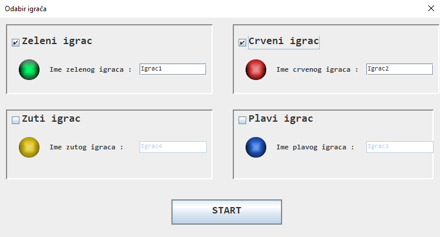
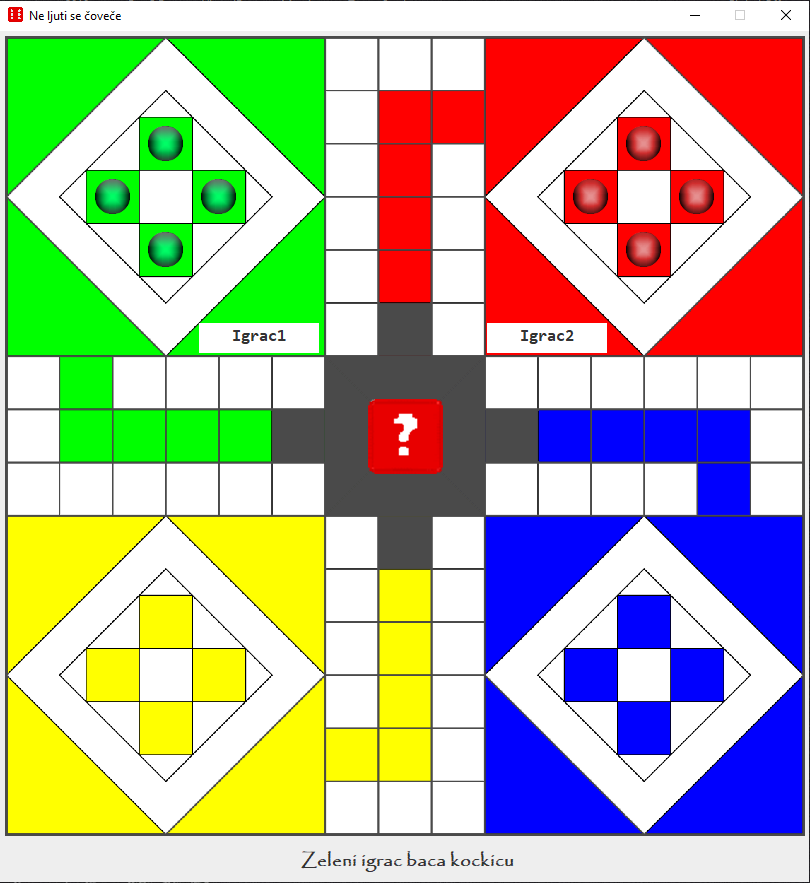

# NeLjutiSeCovece

Društvena igra Ne ljuti se čoveče izradjena u Java programskom jeziku nastala kao završni projekat za predmet Objektno orijentisano programiranje.

___________________________________________________________________________________________________________________________________________________________________________________

Serbian implementation of the game Ludo made using Java programming language

___________________________________________________________________________________________________________________________________________________________________________________

<b>Selection of players</b>

___________________________________________________________________________________________________________________________________________________________________________________

<b>Board</b>

**Eclipse project*
